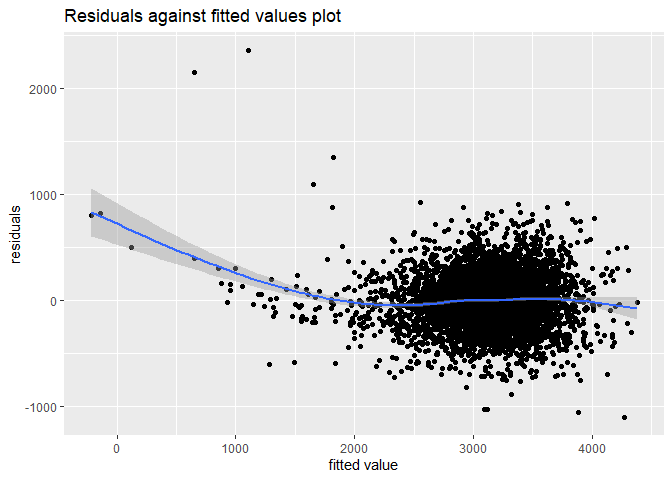

p8105_hw6_sx2337
================
Shun Xie
2022-11-20

``` r
suppressMessages(library(tidyverse))
suppressMessages(library(modelr))

suppressMessages(library(dbplyr))
options(tibble.print_min = 5)
```

# Problem 1

``` r
weather_df = 
  rnoaa::meteo_pull_monitors(
    c("USW00094728"),
    var = c("PRCP", "TMIN", "TMAX"), 
    date_min = "2017-01-01",
    date_max = "2017-12-31") %>%
  mutate(
    name = recode(id, USW00094728 = "CentralPark_NY"),
    tmin = tmin / 10,
    tmax = tmax / 10) %>%
  select(name, id, everything())
```

    ## Registered S3 method overwritten by 'hoardr':
    ##   method           from
    ##   print.cache_info httr

    ## using cached file: C:\Users\ALIENW~1\AppData\Local/Cache/R/noaa_ghcnd/USW00094728.dly

    ## date created (size, mb): 2022-11-20 10:40:09 (8.443)

    ## file min/max dates: 1869-01-01 / 2022-11-30

for $r^2$

``` r
results_df = 
  weather_df %>% 
  modelr::bootstrap(n = 5000) %>% 
  mutate(
    models = map(strap, ~ lm(tmax ~ tmin, data = .x)),
    results_r = map(models, broom::glance),
    results_beta = map(models, broom::tidy)) 
```

``` r
r_val_info = 
  results_df %>% 
  select(results_r) %>% 
  unnest()
```

    ## Warning: `cols` is now required when using unnest().
    ## Please use `cols = c(results_r)`

``` r
r_val_info %>% 
  ggplot(aes(x = r.squared)) + geom_density()
```

<!-- -->

``` r
r_val_info %>% 
  summarize(
    mean_Val = mean(r.squared),
    median_val = median(r.squared),
    se = sd(r.squared),
    "2.5-quantile" = mean(r.squared)+qnorm(0.025)*sd(r.squared),
    "97.5-quantile" = mean(r.squared)+qnorm(0.775)*sd(r.squared)
  )
```

    ## # A tibble: 1 × 5
    ##   mean_Val median_val      se `2.5-quantile` `97.5-quantile`
    ##      <dbl>      <dbl>   <dbl>          <dbl>           <dbl>
    ## 1    0.911      0.912 0.00858          0.894           0.918

R square is likely to be symmetrically distributed with mean 0.91 and
median 0.91.

The 2.5% quantile and 97.5% quantile is therefore: 0.894 to 0.918.

For log_value of beta_0 and beta_1:

``` r
logbeta_val_info = 
  results_df %>% 
  select(results_beta) %>% 
  unnest(results_beta) %>% 
  select(term, estimate) %>% 
  pivot_wider(
    names_from = term,
    values_from = estimate
  ) %>% 
  janitor::clean_names() %>% 
  unnest() %>% 
  mutate(logval = log(intercept+tmin))

logbeta_val_info %>% 
  ggplot(aes(x = logval)) + geom_density()
```

<!-- -->

``` r
logbeta_val_info %>% 
  summarize(
    mean_Val = mean(logval),
    median_val = median(logval),
    se = sd(logval),
    "2.5-quantile" = mean(logval)+qnorm(0.025)*sd(logval),
    "97.5-quantile" = mean(logval)+qnorm(0.775)*sd(logval)
  )
```

    ## # A tibble: 1 × 5
    ##   mean_Val median_val     se `2.5-quantile` `97.5-quantile`
    ##      <dbl>      <dbl>  <dbl>          <dbl>           <dbl>
    ## 1     2.11       2.11 0.0292           2.05            2.13

log value of $log(\beta_0+\beta_1)$ is likely to be symmetrically
distributed with mean 2.11 and median 2.11.

The 2.5% quantile and 97.5% quantile is therefore: 2.053 to 2.132.

# Problem 2

In this question, will explore the homocides data in 50 large US cities.

``` r
homocide_data = read_csv("data/homicide-data.csv", show_col_types = FALSE) %>% 
  replace(is.na(.),0)
homocide_data
```

    ## # A tibble: 52,179 × 12
    ##   uid    repor…¹ victi…² victi…³ victi…⁴ victi…⁵ victi…⁶ city  state   lat   lon
    ##   <chr>    <dbl> <chr>   <chr>   <chr>   <chr>   <chr>   <chr> <chr> <dbl> <dbl>
    ## 1 Alb-0…  2.01e7 GARCIA  JUAN    Hispan… 78      Male    Albu… NM     35.1 -107.
    ## 2 Alb-0…  2.01e7 MONTOYA CAMERON Hispan… 17      Male    Albu… NM     35.1 -107.
    ## 3 Alb-0…  2.01e7 SATTER… VIVIANA White   15      Female  Albu… NM     35.1 -107.
    ## 4 Alb-0…  2.01e7 MENDIO… CARLOS  Hispan… 32      Male    Albu… NM     35.1 -107.
    ## 5 Alb-0…  2.01e7 MULA    VIVIAN  White   72      Female  Albu… NM     35.1 -107.
    ## # … with 52,174 more rows, 1 more variable: disposition <chr>, and abbreviated
    ## #   variable names ¹​reported_date, ²​victim_last, ³​victim_first, ⁴​victim_race,
    ## #   ⁵​victim_age, ⁶​victim_sex

Then, create a city_state variable to combine city and state together,
as well as a binary variable indicating solved and non-solved case. Also
omit cities as required in the question. Additionally, only consider
victim_race as white or black so only include white and black race. Note
that there is some cases where victim_age is unknown and victim_sex has
unknown values, discard them

``` r
homocide_data_new = 
  homocide_data %>%
  mutate(city_state = str_c(city, ", ", state)) %>% 
  mutate(resolved = as.numeric(disposition == "Closed by arrest")) %>% 
  filter(!city_state=="Dallas, TX", !city_state=="Phoenix, AZ", !city_state=="Kansas City, MO", !city_state=="Tulsa, AL") %>% 
  filter(victim_race=="White" | victim_race=="Black") %>% 
  mutate(victim_race = fct_relevel(victim_race, "White")) %>% 
  filter(!victim_age=="Unknown",
         !victim_sex=="Unknown") %>% 
  mutate(victim_age = as.numeric(victim_age),
         victim_sex = ifelse(victim_sex=="Male",1,0))
         

homocide_data_new 
```

    ## # A tibble: 39,362 × 14
    ##   uid    repor…¹ victi…² victi…³ victi…⁴ victi…⁵ victi…⁶ city  state   lat   lon
    ##   <chr>    <dbl> <chr>   <chr>   <fct>     <dbl>   <dbl> <chr> <chr> <dbl> <dbl>
    ## 1 Alb-0…  2.01e7 SATTER… VIVIANA White        15       0 Albu… NM     35.1 -107.
    ## 2 Alb-0…  2.01e7 MULA    VIVIAN  White        72       0 Albu… NM     35.1 -107.
    ## 3 Alb-0…  2.01e7 BOOK    GERALD… White        91       0 Albu… NM     35.2 -107.
    ## 4 Alb-0…  2.01e7 MARTIN… GUSTAVO White        56       1 Albu… NM     35.1 -107.
    ## 5 Alb-0…  2.01e7 GRAY    STEFAN… White        43       0 Albu… NM     35.1 -107.
    ## # … with 39,357 more rows, 3 more variables: disposition <chr>,
    ## #   city_state <chr>, resolved <dbl>, and abbreviated variable names
    ## #   ¹​reported_date, ²​victim_last, ³​victim_first, ⁴​victim_race, ⁵​victim_age,
    ## #   ⁶​victim_sex

Now as required, use the glm function to fit a logistic regression with
resolved vs unresolved as the outcome and victim age, sex and race as
predictors for the city of Baltimore, MD.

``` r
# save the glm as r object
Baltimore_model= 
  homocide_data_new %>% 
  filter(city_state=="Baltimore, MD") %>% 
  glm(resolved ~ victim_age+victim_race+victim_sex, data=., family= binomial(link = "logit")) 
```

Based on the model, can obtain the log odds ratio estimate and
confidence interval. After that, transfer to odds ratio by taking
exponential of all values calculated.

``` r
Baltimore_model %>% 
  broom::tidy() %>% 
  mutate(lower_conf = confint(Baltimore_model)[,1],
         upper_conf = confint(Baltimore_model)[,2]) %>% 
  filter(term=='victim_sex') %>% 
  select(estimate, lower_conf, upper_conf) %>% 
  mutate(estimate = exp(estimate),
         lower_conf = exp(lower_conf),
         upper_conf = exp(upper_conf))
```

    ## Waiting for profiling to be done...
    ## Waiting for profiling to be done...

    ## # A tibble: 1 × 3
    ##   estimate lower_conf upper_conf
    ##      <dbl>      <dbl>      <dbl>
    ## 1    0.426      0.324      0.558

Therefore, in comparison to the baseline which is female, male has 0.425
times higher odds chance of getting a resolved case. Meaning that male
has a lower chance to have a solved case than female.

Repeat the process to all cities:

``` r
distinct_cities_df = 
  homocide_data_new %>% 
  select(city_state, victim_race:victim_sex, resolved) %>% 
  nest(sample = victim_race:resolved) %>% 
  mutate(
    models = map(sample, ~glm(resolved ~ victim_age+victim_race+victim_sex, family= binomial(link = "logit"), data=.x)),
    results = map(models, broom::tidy),
    conf_int = map(models, ~confint(.x,"victim_sex"))
  ) %>% 
  select(city_state,results,conf_int) %>% 
  unnest(results) %>% 
  unnest_wider(conf_int) %>% 
  filter(term=="victim_sex") %>% 
  select(city_state,estimate,`2.5 %`,`97.5 %`) %>% 
  #convert to odds scale
  mutate(
    estimate=exp(estimate),
    `2.5 %` =exp(`2.5 %`),
    `97.5 %` = exp(`97.5 %`)
    )
```

    ## Waiting for profiling to be done...
    ## Waiting for profiling to be done...
    ## Waiting for profiling to be done...
    ## Waiting for profiling to be done...
    ## Waiting for profiling to be done...
    ## Waiting for profiling to be done...
    ## Waiting for profiling to be done...
    ## Waiting for profiling to be done...
    ## Waiting for profiling to be done...
    ## Waiting for profiling to be done...
    ## Waiting for profiling to be done...
    ## Waiting for profiling to be done...
    ## Waiting for profiling to be done...
    ## Waiting for profiling to be done...
    ## Waiting for profiling to be done...
    ## Waiting for profiling to be done...
    ## Waiting for profiling to be done...
    ## Waiting for profiling to be done...
    ## Waiting for profiling to be done...
    ## Waiting for profiling to be done...
    ## Waiting for profiling to be done...
    ## Waiting for profiling to be done...
    ## Waiting for profiling to be done...
    ## Waiting for profiling to be done...
    ## Waiting for profiling to be done...
    ## Waiting for profiling to be done...
    ## Waiting for profiling to be done...
    ## Waiting for profiling to be done...
    ## Waiting for profiling to be done...
    ## Waiting for profiling to be done...
    ## Waiting for profiling to be done...
    ## Waiting for profiling to be done...
    ## Waiting for profiling to be done...
    ## Waiting for profiling to be done...
    ## Waiting for profiling to be done...
    ## Waiting for profiling to be done...
    ## Waiting for profiling to be done...
    ## Waiting for profiling to be done...
    ## Waiting for profiling to be done...
    ## Waiting for profiling to be done...
    ## Waiting for profiling to be done...
    ## Waiting for profiling to be done...
    ## Waiting for profiling to be done...
    ## Waiting for profiling to be done...
    ## Waiting for profiling to be done...
    ## Waiting for profiling to be done...
    ## Waiting for profiling to be done...

``` r
distinct_cities_df
```

    ## # A tibble: 47 × 4
    ##   city_state      estimate `2.5 %` `97.5 %`
    ##   <chr>              <dbl>   <dbl>    <dbl>
    ## 1 Albuquerque, NM    1.77    0.825    3.76 
    ## 2 Atlanta, GA        1.00    0.680    1.46 
    ## 3 Baltimore, MD      0.426   0.324    0.558
    ## 4 Baton Rouge, LA    0.381   0.204    0.684
    ## 5 Birmingham, AL     0.870   0.571    1.31 
    ## # … with 42 more rows

Now create a plot as following:

``` r
ggplot(distinct_cities_df, aes(x=fct_reorder(city_state, estimate), y=estimate))+
  geom_point()+
  geom_errorbar(aes(ymin=`2.5 %`, ymax=`97.5 %`))+
  labs(title = "Number of unsolved homocide among cities", )+xlab("City")+
  theme(axis.text.x = element_text(angle = 80, hjust = 1))
```

<!-- -->

Can be ssen on the plot, most of the cities have an estimate less than
one, meaning that male are less likely to have a solved case than
female, which is set to be the base line of the logistic regression.
Some cities like New York, Baton Rouge, Chicago etc have an interval
that does not intercept 1, meaning that these cities have a significant
difference for solving cases between gender. It is likely that female
has a greater chance to have a homocide case solved than male. On ther
other hand, the city of Albuquerque, NM have a much higher estimate for
male to have a case solved. But the confidence interval overlap the
value of one, so we do not have enough evidence to prove that male and
female have significantly difference in number of unsolved case.

# Problem 3

First, load and have a look at the data.

``` r
birthweight = read_csv("data/birthweight.csv", show_col_types = FALSE)
birthweight
```

    ## # A tibble: 4,342 × 20
    ##   babysex bhead blength   bwt delwt fincome frace gaweeks malform menarche
    ##     <dbl> <dbl>   <dbl> <dbl> <dbl>   <dbl> <dbl>   <dbl>   <dbl>    <dbl>
    ## 1       2    34      51  3629   177      35     1    39.9       0       13
    ## 2       1    34      48  3062   156      65     2    25.9       0       14
    ## 3       2    36      50  3345   148      85     1    39.9       0       12
    ## 4       1    34      52  3062   157      55     1    40         0       14
    ## 5       2    34      52  3374   156       5     1    41.6       0       13
    ## # … with 4,337 more rows, and 10 more variables: mheight <dbl>, momage <dbl>,
    ## #   mrace <dbl>, parity <dbl>, pnumlbw <dbl>, pnumsga <dbl>, ppbmi <dbl>,
    ## #   ppwt <dbl>, smoken <dbl>, wtgain <dbl>

``` r
sum(is.na(birthweight))
```

    ## [1] 0

The data has 4342 samples with 20 variables. The frace, mrace are in
numeric value. Thus, need to change them into factors. Additionally,
gender may also be changed to factors There is no missing value but
there are some values that has unknown value. Thus, need to discard the
unknown value. The other values are in numerical form.

``` r
birthweight_adpt = 
  birthweight %>% 
  mutate(
    frace = recode(frace, `1` = "White", `2` = "Black", `3` = "Asian", `4` = "Puerto Rican", `8` = "Other", `9` = "Unknown"),
    mrace = recode(mrace, `1` = "White", `2` = "Black", `3` = "Asian", `4` = "Puerto Rican", `8` = "Other"),
    babysex = recode(babysex, `1` = "Male", `2` = "Female")
    )%>% 
    filter(frace!="Unknown") %>%
  mutate(
    frace = fct_relevel(frace, "White"),
    mrace = fct_relevel(mrace, "White"),
    babysex = fct_relevel(babysex,"Female")
         )
birthweight_adpt
```

    ## # A tibble: 4,342 × 20
    ##   babysex bhead blength   bwt delwt fincome frace gaweeks malform menarche
    ##   <fct>   <dbl>   <dbl> <dbl> <dbl>   <dbl> <fct>   <dbl>   <dbl>    <dbl>
    ## 1 Female     34      51  3629   177      35 White    39.9       0       13
    ## 2 Male       34      48  3062   156      65 Black    25.9       0       14
    ## 3 Female     36      50  3345   148      85 White    39.9       0       12
    ## 4 Male       34      52  3062   157      55 White    40         0       14
    ## 5 Female     34      52  3374   156       5 White    41.6       0       13
    ## # … with 4,337 more rows, and 10 more variables: mheight <dbl>, momage <dbl>,
    ## #   mrace <fct>, parity <dbl>, pnumlbw <dbl>, pnumsga <dbl>, ppbmi <dbl>,
    ## #   ppwt <dbl>, smoken <dbl>, wtgain <dbl>

First hypothesis that all factors are related to baby’s weight. For
instance, a female baby may likely to have different weight than male
baby due to different biological structure. Also other factors such as
family income may also be related to baby’s weight because a affluent
family may have a better diet and therefore baby may have more nutrition
than those family in poverty. Therefore, I choose all the factors to
start with, and using backward selection to select the model.

``` r
# Fit the full model 
Full_model <- lm(bwt ~., data = birthweight_adpt)
# begin stepwise procedure
Stepwise_model <- MASS::stepAIC(Full_model, direction = "backward", trace = FALSE)
summary(Stepwise_model)
```

    ## 
    ## Call:
    ## lm(formula = bwt ~ babysex + bhead + blength + delwt + fincome + 
    ##     gaweeks + mheight + mrace + parity + ppwt + smoken, data = birthweight_adpt)
    ## 
    ## Residuals:
    ##      Min       1Q   Median       3Q      Max 
    ## -1097.18  -185.52    -3.39   174.14  2353.44 
    ## 
    ## Coefficients:
    ##                     Estimate Std. Error t value Pr(>|t|)    
    ## (Intercept)       -6070.2639   136.9081 -44.338  < 2e-16 ***
    ## babysexMale         -28.5580     8.4549  -3.378 0.000737 ***
    ## bhead               130.7770     3.4466  37.944  < 2e-16 ***
    ## blength              74.9471     2.0190  37.120  < 2e-16 ***
    ## delwt                 4.1067     0.3921  10.475  < 2e-16 ***
    ## fincome               0.3180     0.1747   1.820 0.068844 .  
    ## gaweeks              11.5925     1.4621   7.929 2.79e-15 ***
    ## mheight               6.5940     1.7849   3.694 0.000223 ***
    ## mraceAsian          -74.8868    42.3146  -1.770 0.076837 .  
    ## mraceBlack         -138.7925     9.9071 -14.009  < 2e-16 ***
    ## mracePuerto Rican  -100.6781    19.3247  -5.210 1.98e-07 ***
    ## parity               96.3047    40.3362   2.388 0.017004 *  
    ## ppwt                 -2.6756     0.4274  -6.261 4.20e-10 ***
    ## smoken               -4.8434     0.5856  -8.271  < 2e-16 ***
    ## ---
    ## Signif. codes:  0 '***' 0.001 '**' 0.01 '*' 0.05 '.' 0.1 ' ' 1
    ## 
    ## Residual standard error: 272.3 on 4328 degrees of freedom
    ## Multiple R-squared:  0.7181, Adjusted R-squared:  0.7173 
    ## F-statistic: 848.1 on 13 and 4328 DF,  p-value: < 2.2e-16

Based on the model selected, I plot the residuals against fitted values:

``` r
birthweight_adpt %>% 
  add_predictions(Stepwise_model) %>% 
  add_residuals(Stepwise_model) %>% 
  ggplot(aes(x = pred, y = resid)) + geom_point() +
  labs(title = "Residuals against fitted values plot", )+xlab("fitted value")+ylab("residuals")
```

<!-- -->

Although the plot may show some trends, the overall fitting is okay and
the model has a relatively high r square hence the model has a
relatively high explained variance.

Now fit the other two models as well as the chosen stepwise model using
cross validation.

``` r
#first create a dataframe 
cv_df =
  crossv_mc(birthweight_adpt, 100) %>% 
  mutate(
    train = map(train, as_tibble),
    test = map(test, as_tibble))

#then fit three models:
cv_df = 
  cv_df %>% 
  mutate(
    my_model  = map(train, ~lm( bwt ~ babysex + bhead + blength + delwt + fincome + 
    gaweeks + mheight + mrace + parity + ppwt + smoken, data = .x)),
    main_effect_model  = map(train, ~lm(bwt ~ gaweeks + blength, data = .x)),
    interactive_model  = map(train, ~lm(bwt ~ bhead*blength*babysex, data = .x))) %>% 
  mutate(
    rmse_my_model = map2_dbl(my_model, test, ~rmse(model = .x, data = .y)),
    rmse_main_effect    = map2_dbl(main_effect_model, test, ~rmse(model = .x, data = .y)),
    rmse_interactive = map2_dbl(interactive_model, test, ~rmse(model = .x, data = .y)))

#Get the summarize the result:
cv_df %>% 
  summarize(
    rmse_my_model_mean = mean(rmse_my_model),
    rmse_main_effect_mean = mean(rmse_main_effect),
    rmse_interactive_meam = mean(rmse_interactive)
  )
```

    ## # A tibble: 1 × 3
    ##   rmse_my_model_mean rmse_main_effect_mean rmse_interactive_meam
    ##                <dbl>                 <dbl>                 <dbl>
    ## 1               273.                  335.                  289.

As indicated by the RMSE results, my model has the lowest rmse, with a
decent adjusted r square value (which also considered the complexity of
the model). Therefore, I choose my model with baby’s sex, baby head
circumference, baby’s length at birth, mother weight at delivery, family
monthly income, gestational age in weeks, mother’s height, mother race,
number of live births prior to this pregnancy, mother’s pre-pregnancy
BMI and mother’s weight gain during pregnancy as predictors.
